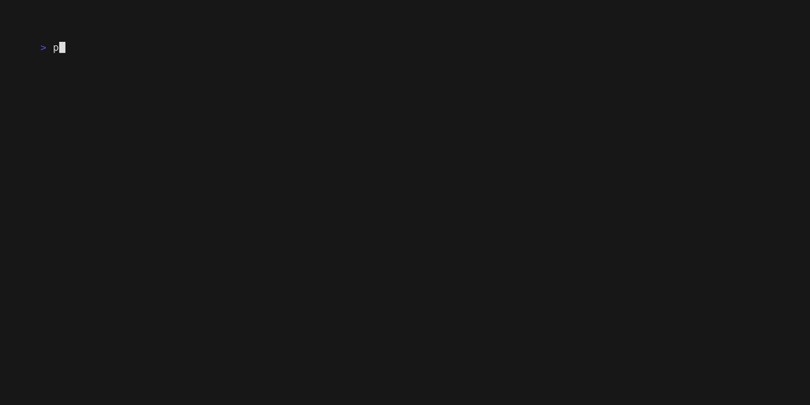

# lockdiff

Reading lockfile diffs is crazy. Thousands of lines of churn for a handful of real changes. `lockdiff` is a human-oriented parser: feed it two lockfiles, get back what was added, removed, and bumped.

Works on `uv.lock` (Python) and `package-lock.json` (npm).

## Demo

uv:


npm:



## Usage

```sh
python -m lockdiff old.lock new.lock
```

The ecosystem is auto-detected from file contents. Override if needed:

```sh
python -m lockdiff --ecosystem npm old.json new.json
```

Exit codes: `0` if there are no changes, `1` if there are changes, `2` on error.

### Docker

```sh
docker build -t lockdiff .
docker run --rm -v "$PWD:/work" lockdiff /work/old.lock /work/new.lock
```

## Architecture

```
src/lockdiff/
├── __main__.py     CLI: argparse → detect → parse → diff → render
├── detect.py       Sniffs first non-whitespace byte: '{' = npm, else uv
├── Parser.py       Parses uv.lock (TOML) → dict[name, Package]
├── Parser_npm.py   Parses package-lock.json → dict[name, Package]
├── diff.py         Set diff by name; same-name + different-version = bump
└── render.py       ANSI-colored boxes and a summary line
```

Both parsers return the same shape (`dict[str, Package]`), so `diff` and `render` don't care which ecosystem the input came from. npm trees often hold multiple versions of the same package; lockdiff collapses them per name (direct beats transitive, then highest version wins).

Read more at [Drawing Board](https://basz-website.basgug25.workers.dev/vault/Lockdiff/)
